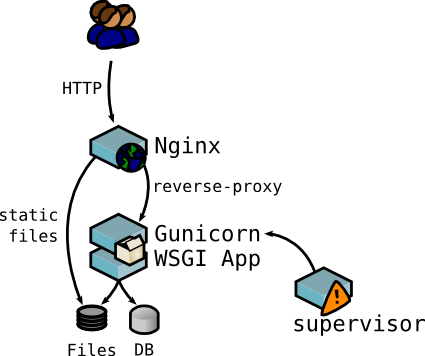

Install Minion in production
############################

.. note:: 

    If you are new to Minion, you probably want to check out :doc:`getting_started` instead.
    This document is for users who want to know how to set up Minion in a production environment.

Pre-requisites
==============

* Minion has been developed primarily on Ubuntu 12.04 and 13.04 so running Minion on other systems is not a guarantee

* Python 2.7+ (not Python 3 compatible)

First, we need these dependencies fulfill:

.. code-block:: bash

    $ sudo apt-get update
    $ sudo apt-get install git build-essential python-virtualenv python-dev rabbitmq-server mongodb-server curl libcurl4-openssl-dev nginx supervisor

Secondly, we'll need a user for Minion:

We need to create a specific user for Minion in order to isolate it for purposes of administration but also in order
to give the necessary rights to tools used by Minion such as Nmap or Masscan.

To create a new user, follow these steps:

.. code-block:: bash

    $ sudo adduser minion # Where minion is the new user

Information to assign to the new user account is then requested. Press the [Enter] key saves the information filled in and go to the next question

Now let's identify us as the new user :

.. code-block:: bash

    $ su minion

Now, let's install Minion !

What we are going to do is to install Minion as a WSGI application on a server, following this architecture :

.. _install_backend_label:

First step, we need to install our application, that is to say Minion.

For that, create a repository for Minion:

.. code-block:: bash

    # In your home directory '/home/minion'
    $ mkdir minion
    $ cd minion

As said in the introduction of this documentation, Minion is divided in two parts : Backend & Frontend. So we'll install it in two phases.

Before of that, we'll create a virtual environment for Minion where all its dependencies will be put.

.. code-block:: bash

    $ virtualenv -p python2.7 --no-site-packages "./env"
    $ source "./env/bin/activate"

.. note::

    The creation of this virtual environment is not mandatory but it's better if you host many projects on your server.
    Moreover it'll make your installation easier and cleaner. The rest of this tutorial considers that an virtual environment
    is installed as the previous way.

Install Minion Backend
======================

.. code-block:: bash

    $ git clone https://github.com/Wawki/minion-backend.git
    $ cd minion-backend
    $ python setup.py install

.. _install_frontend_label:

Install Minion Frontend
=======================

Similar to the backend (see above):

.. code-block:: bash

    # If you are still in the minion-backend repository :
    $ cd ..
    # Then
    $ git clone https://github.com/Wawki/minion-frontend.git
    $ cd minion-frontend
    $ python setup.py install

Configure Minion Backend & Frontend
===================================

To configure Minion Backend & Frontend, see :doc:`configure_minion`.

Configure nginx
===============

Its our front-end web server (for Minion Frontend). We will use it for two different roles : reverse proxy to Gunicorn and serve static files.

You can find a default configuration in the ``minion-frontend/etc`` repository with the name **minion-server.nginx.conf**.

You'll have to edit it to your conveniences. Here the highlighted lines you may have to change :

.. code-block:: guess
    :emphasize-lines: 2,7,13,15,16,19,20

    upstream minion_frontend {
      server 127.0.0.1:4000 fail_timeout=0;
    }

    server {
      listen 80;
      server_name localhost;
      rewrite ^  https://$host$request_uri? permanent;
    }

    server {
      listen 443;
      server_name localhost;

      access_log /var/log/nginx/minion-dev.access.log;
      error_log /var/log/nginx/minion-dev.error.log;

      ssl on;
      ssl_certificate /etc/ssl/private/minion.crt;
      ssl_certificate_key /etc/ssl/private/minion.key;

      ssl_session_timeout 5m;

      ssl_protocols SSLv3 TLSv1 TLSv1.1 TlSv1.2;
      ssl_ciphers ALL:!ADH:!aNULL:!PSK:!MD5:!AES:!EXPORT:+HIGH:!MEDIUM:!LOW:!SSLv2;
      ssl_prefer_server_ciphers on;
      ssl_session_cache shared:Minion:4m;

      add_header X-Content-Type-Options nosniff;
      add_header Strict-Transport-Security max-age=31536000;
      add_header X-Frame-Options DENY;
      add_header X-XSS-Protection "1; mode=block";
      add_header Content-Security-Policy "default-src 'self'; script-src 'self' https://login.persona.org; frame-src https://login.persona.org";

      location / {
        proxy_set_header X-Forwarded-Host $host;
        proxy_set_header X-Forwarded-Server $host;
        proxy_set_header X-Forwarded-For $proxy_add_x_forwarded_for;
        proxy_set_header Host $http_host;
        proxy_redirect off;
        proxy_pass http://minion_frontend;
      }
    }

.. note::

    As you can see, nginx is configured to support SSL. For this to work, you must create a certificate for Minion.
    For more information on how to create certificate please visit this page : https://help.ubuntu.com/12.04/serverguide/certificates-and-security.html

After that, we'll need to copy this configuration into the configuration directory of nginx and restart it :

.. code-block:: bash

    $ sudo cp ./minion-server.nginx.conf /etc/nginx/conf.d/minion.conf
    $ sudo service nginx restart

Configure Gunicorn
==================

Gunicorn is a HTTP / WSGI server developed in Python. His role will be hosting our WSGI application (Minion) and thus made the interface between Nginx and our app.

We have nothing to configure for Gunicorn. As it's started by supervisor, there is nothing more to do here.

Configure Supervisor
====================

Now, let's talk about Supervisor. It's a process control system. To be more meaningful, its purpose is to start Gunicorn and be sure that it will always be running (restarting it if necessary).

For each script of minion, we'll need a configuration for Supervisor to launch it and supervise it.
Default scripts are in ``minion-backend/etc`` and ``minion-frontend/etc`` with the name script_name.supervisor.conf.

For each configuration, you have to change the path of minion ``home/user/minion/...`` to your configuration.

Then, we need to copy all this configuration file in the configuration repository of Supervisor :

.. code-block:: bash

    # In the minion repository :
    $ sudo cp minion-*/etc/*.supervisor.conf /etc/supervisor/conf.d
    $ supervisorctl update

Create Minion Admin
===================

Almost there! The very last bit is to create a Minion super user. To do this, the backend comes with a handy script
called ``minion-db-init``.

.. code-block:: bash

    $ cd minion
    $ cd minion-backend/scripts
    $ ./minion-db-init

    Enter the administrator's email:
    Enter the administrator's name:
    Do you want to import some test sites into minion? [y/n]

You don't have to provide a real name, but this is the name we use in formal information such as sending invitation
to a friend to join Minion.

You also don't need to import test sites. By test sites we mean security testing sites. These sites are developed
and free to security testers for testing security tools. We encourage new users to import them when learning about
Minion. You can always delete them later.

|
|

Now everything is started ... but ... [ TODO ]

Configure LDAP authentication
=============================

By default, Minion offers a authentication with Persona but you can also use a LDAP authentication.
If you want to keep the Persona authentication, then skip this part. Else, here are the steps to follow :

If you don't already have a ldap server, you can follow this tutorial : https://www.digitalocean.com/community/tutorials/how-to-install-and-configure-a-basic-ldap-server-on-an-ubuntu-12-04-vps

Now, if you have put your ldap server on another machine than Minion. You'll need to set up ... [ TODO ]

Finally, you need to change the frontend configuration to provide the necessary information to Minion.
To do that, look here :doc:`configure_minion`

|
|
|

It's finish for the installation of Minion. Now you can explore the frontend or install some new plugins.

Explore the frontend
====================

I have a separate page to guide you how to use the frontend. Please check :doc:`using_frontend`.

Install New Plugins
===================

Plugins are essentials. As a new Minion owner, you should try installing new plugins. We have
a separate guide on this topic, so please check :doc:`install_plugins`.

